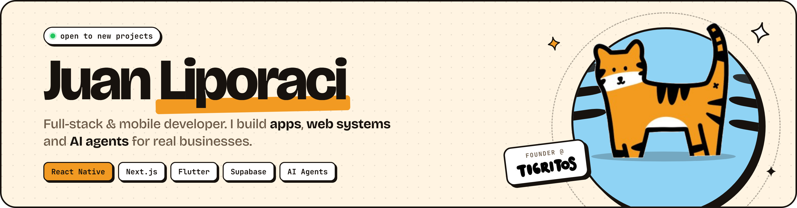

<div align="center">
  

  <h1>Hey, I'm Juan 👋</h1>

  <a href="https://github.com/JuanLiporaci">
    
  </a>

  <p>
    <a href="https://www.linkedin.com/in/juan-liporaci-6610bb169/"></a>
    <a href="https://portfolio-zeta-nine-dg9wrh75bo.vercel.app"></a>
    <a href="https://play.google.com/store/apps/details?id=com.tigritos.app&pcampaignid=web_share"></a>
    <a href="https://apps.apple.com/ve/app/tigritos/id6756139037"></a>
  </p>
</div>

---

### ⚡ About me

```ts
const juan = {
  location: "Venezuela 🇻🇪",
  role: "Full-Stack & Mobile Developer",
  building: "Tigritos — verified workers, on demand",
  shipping: ["mobile apps", "web apps for real businesses", "AI agents", "e-commerce"],
  languages: ["Spanish", "English"],
  currently: "turning repetitive business work into automations",
};
```

I build products end to end — from the database schema to the app in the store. I care about clean UX, fast delivery, and software that real businesses actually use every day.

---

### 🚀 What I've been shipping

<table>
  <tr>
    <td width="50%" valign="top">
      <h4>🐯 Tigritos</h4>
      Marketplace app that connects people with <b>verified workers</b> in Venezuela. Live on both stores.<br/><br/>
      <code>React Native</code> <code>Expo</code> <code>TypeScript</code><br/><br/>
      <a href="https://apps.apple.com/ve/app/tigritos/id6756139037">App Store</a> ·
      <a href="https://play.google.com/store/apps/details?id=com.tigritos.app&pcampaignid=web_share">Google Play</a>
    </td>
    <td width="50%" valign="top">
      <h4>🐝 Apis</h4>
      Family chore app that turns house tasks into flowers, effort into pollen and consistency into streaks.<br/><br/>
      <code>Flutter</code> <code>Dart</code> <code>PostgreSQL</code><br/><br/>
      <a href="https://apis-colmena.vercel.app">apis-colmena.vercel.app</a>
    </td>
  </tr>
  <tr>
    <td width="50%" valign="top">
      <h4>🤖 WhatsApp AI Agent</h4>
      Plug-and-play AI agent for business WhatsApp numbers: answers customers, qualifies leads, and works with GPT, Claude or Gemini.<br/><br/>
      <code>TypeScript</code> <code>LLMs</code> <code>WhatsApp API</code>
    </td>
    <td width="50%" valign="top">
      <h4>🛒 González Imports</h4>
      Custom Shopify store with a payments server for local methods (Pago Móvil, Cashea, BCV exchange rate) and catalog import scripts.<br/><br/>
      <code>Shopify</code> <code>Liquid</code> <code>Node.js</code> <code>GraphQL</code>
    </td>
  </tr>
  <tr>
    <td width="50%" valign="top">
      <h4>🐾 GlobalPets &amp; vet clinic systems</h4>
      Clinic management for veterinarians: patients, appointments, hospitalization and more.<br/><br/>
      <code>JavaScript</code> <code>Vercel</code><br/><br/>
      <a href="https://global-pets-mu.vercel.app">global-pets-mu.vercel.app</a>
    </td>
    <td width="50%" valign="top">
      <h4>❄️ Business sites &amp; systems</h4>
      Websites and internal tools for local companies — <a href="https://ice-cars.vercel.app">ICE CARS</a>, Oxígenos Bello Monte, Metropolitana Care — plus Telegram bots for orders and expenses.<br/><br/>
      <code>Next.js</code> <code>React</code> <code>Supabase</code>
    </td>
  </tr>
</table>

---

### 🧰 Tech stack

<p align="center">
  <a href="https://skillicons.dev">
    
    <br/>
    
  </a>
</p>

<p align="center">
  
  
  
  
  
  
  
</p>

---

### 📊 GitHub stats

<div align="center">
  
  
  <br/>
  
</div>

---

<div align="center">
  <b>Got a project, an app idea, or a process that should run itself? Let's talk.</b><br/><br/>
  <a href="https://www.linkedin.com/in/juan-liporaci-6610bb169/"></a>
  <br/><br/>
  
</div>
